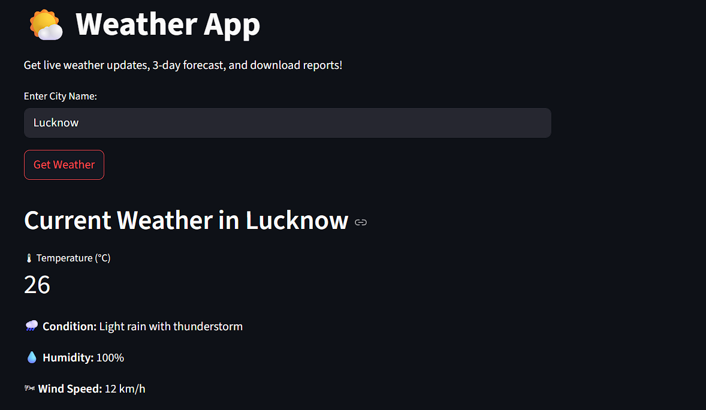
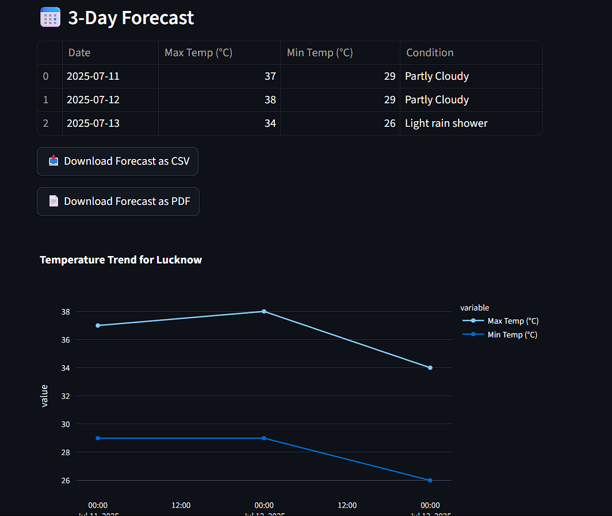

# Advanced Weather Dashboard
A Streamlit web app that shows live weather data, a 3-day forecast, interactive charts, and lets you download reports as CSV & PDF.
Built using wttr.in for weather scraping — no API keys required!
Check out here : https://weather-app-y8ynr795qxhh64v8cml7qu.streamlit.app/

# Features
✅ Live current weather:
Temperature, humidity, wind speed, weather condition
Emoji icons based on weather description

✅ 3-day forecast:
Displays date, max/min temperatures, sky condition in a clean table

✅ Interactive line chart:
Plots temperature trends over the forecast period using Plotly

✅ Download reports:
Download forecast as CSV or PDF with a single click

# 🛠 Tech stack & libraries used
Tool	What it does
🐍 Python	Base language
🚀 Streamlit	Interactive web app framework
🌐 Requests	To scrape weather data from wttr.in
🐼 Pandas	For structured forecast tables & CSV export
📊 Plotly	For plotting temperature trends
📝 FPDF2	For generating downloadable PDF reports
🖌 CSS	Used via st.markdown to apply dynamic dark/light themes

# ⚙ How it works
Fetches weather data for the specified city using:

perl
Copy
Edit
https://wttr.in/<city>?format=j1
Parses JSON to get current conditions & forecast.

- Displays data in Streamlit widgets and Plotly charts.
- Generates downloadable CSV & PDF reports.

# 📷 Screenshots
Current Weather & Forecast Table	Interactive Chart & Downloads

 

